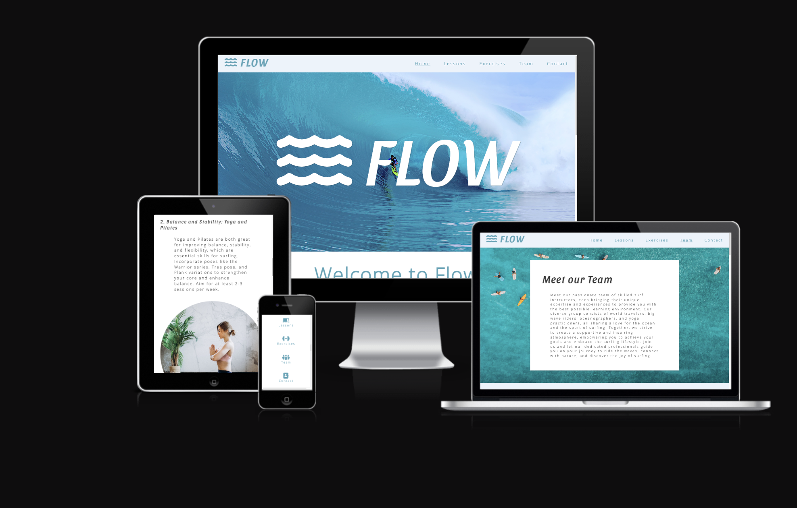

# Flow Website

This repository contains the source code for Flow, a surfing website designed for surfers of all skill levels who are passionate about riding the waves. The website provides comprehensive lessons, fitness tips, and a community of like-minded individuals to help users take their surfing skills to new heights.

[View Flow on Github Pages](https://github.com/ArchivistIX/flow)

## CONTENTS

* [User Experience (UX)](#User-Experience-(UX))
  * [Initial Discussion](#Initial-Discussion)
  * [User Stories](#User-Stories)

* [Design](#Design)
  * [Colour Scheme](#Colour-Scheme)
  * [Typography](#Typography)
  * [Imagery](#Imagery)
  * [Wireframes](#Wireframes)
  * [Features](#Features)
  * [Accessibility](#Accessibility)

* [Technologies Used](#Technologies-Used)
  * [Languages Used](#Languages-Used)

* [Deployment & Local Development](#Deployment-&-Local-Development)
  * [Deployment](#Deployment)
  * [Local Development](#Local-Development)
    * [How to Fork](#How-to-Fork)
    * [How to Clone](#How-to-Clone)

* [Testing](#Testing)
  * [W3C Validator](#W3C-Validator)
  * [Solved Bugs](#Solved-Bugs)
  * [Known Bugs](#Known-Bugs)
  
* [Credits](#Credits)
  * [Code Used](#Code-Used)
  * [Content & Media](#Content-&-Media)
  * [Acknowledgments](#Acknowledgments)

- - -

## User Experience (UX)

### Initial Discussion

Flow is a comprehensive website that caters to surfers of all skill levels.

It offers engaging surfing lessons, tailored fitness exercises, and a dedicated team page to connect users with experienced instructors.

The site aims to be the go-to resource for surf enthusiasts looking to enhance their skills, improve their fitness, and become part of a vibrant surfing community.

#### Key information for the site

* Key information on surfing.
* Lessons offer you a quick yet comprehensive guide to start surfing straight away.
* Exercises offer you some options to add to your daily routine to improve your surfing.
* Information about our dedicated team members.
* Way to contact us.

### User Stories

#### Client Goals

* To be able to view the site on a range of device sizes.
* To make it easy for potential members to find out what surfing is and how to take part.
* To make it clear for people how to start their surfing journey.
* To allow people to be able to contact the Flow to ask further questions.

#### First Time Visitor Goals

* I want to find out what surfing is and how I can take part.
* I want to be able to navigate the site easily to find information.
* I want to be able to find their social media profiles.

#### Returning Visitor Goals

* I want to progress in my surfing and fitness.
* I want to be able to easily contact Flow with questions I might have.

#### Frequent Visitor Goals

* I want to get to more advanced topics and put them into my practice.

- - -

## Design

### Colour Scheme

The website uses a palette of blues that are reminiscent of sea. The colour palette was discovered at [Canva](https://www.canva.com/colors/color-palettes/surfs-up-2/) website.

### Typography

Google Fonts was used for the following fonts:

* Sansita is used for headings on the site.

* Open-sans is used for the body text on the site.  

### Imagery

Images used were from [Pexels](https://www.pexels.com/) website. I have credited these in the [credits](#Credits) section.

### Wireframes

Wireframes were created for mobile, tablet and desktop.

Desktop - Home Page Wireframe

Mobile - Exercises Wireframe

Team - Tablet Wireframe

### Features

The website is comprised of five pages, all of which are accessible from the navigation menu (home page, exercises page, lessons page, team page and contact page).

* All Pages on the website have:

  * A responsive navigation bar at the top right which allows the user to navigate through the site.  To the left of the navigation bar is a logo together with the text Flow. To allow a good user experience of the site, the navigation bar is responsive with a media query on mobile devices to prevent the navigation bar looking cluttered. When viewing with mobile devices the navigation links change to a column underneath the logo. This was implemented to give the site a clean look and to promote a good user experience.

  * A footer which contains social media links, with icons, to instagram, facebook and twitter, and also to different pages on the website.

* Home Page.
  * Hero Image.
  Hero image and animated words show spirit of surfing and set the right tone for the whole website.
  * Welcome to Flow.
This section welcomes users to the page and shares companies joy of surfing. It also features navigation elements, each with it's on icon styling.
  * Summary Sections.
  This section gives the user more information of what they can expect from the website.

* Lessons Page
  * Lessons Summary.
  Discover tailored surfing lessons with experienced instructors in a fun, supportive environment for all skill levels.
  * Beginner, Intermediate and Advance Lessons.
  Discover the exhilarating world of surfing through our comprehensive lessons, tailored for beginners to advanced surfers, with engaging content including videos to guide you every step of the way.

* Exercises Page.
  * Explore our diverse range of surfing-specific exercises designed to improve your strength, balance, and flexibility, ensuring you're well-equipped to conquer the waves with confidence.
  * Tips on how to incorporate exercising in daily life.

* Team Page.
  * Meet our dedicated team of experienced surf instructors, passionate about sharing their knowledge and expertise to help you master the art of surfing and enhance your skills on the waves.
  
* Contact Page.
  * Get in touch with us through our Contact page to ask questions, share your feedback, or schedule your surfing lessons with our professional instructors, ensuring a smooth and enjoyable experience.

* Future Implementations.
  * Use javascript to perform return to top function on all of the pages.
  * Use javascript to better organise exercise sections for better user experience.
  * Community page - with gallery and user reviews/experiences.
  * Competitions/giveaways page - This page would give further information/rules on the competitions and giveaways Flow hosts.

### Accessibility

I have been mindful during coding to ensure that the website is as accessible friendly as possible. I have achieved this by:

* Using semantic HTML.
* Using descriptive alt attributes on images on the site.
* Ensuring that there is a sufficient colour contrast throughout the site.

- - -

## Technologies Used

### Languages Used

HTML and CSS were used to create this website.

### Frameworks, Libraries & Programs Used

Balsamiq - Used to create wireframes.

Git - For version control.

Github - To save and store the files for the website.

Google Fonts - To import the fonts used on the website.

Font Awesome - For the iconography on the website.

Google Dev Tools - To troubleshoot and test features, solve issues with responsiveness and styling.

[Favicon.io](https://favicon.io/) To create favicon.

[Am I Responsive?](http://ami.responsivedesign.is/) To show the website image on a range of devices.

- - -

## Deployment & Local Development

### Deployment

Github Pages was used to deploy the live website.

### Local Development

#### How to Fork

To fork the Flow repository:

1. Log in (or sign up) to Github.
2. Go to the repository for this project, ArchivistIX/flow.
3. Click the Fork button in the top right corner.

#### How to Clone

To clone the Flow repository:

1. Log in (or sign up) to GitHub.
2. Go to the repository for this project, ArchivistIX/flow.
3. Click on the code button, select whether you would like to clone with HTTPS, SSH or GitHub CLI and copy the link shown.
4. Open the terminal in your code editor and change the current working directory to the location you want to use for the cloned directory.
5. Type 'git clone' into the terminal and then paste the link you copied in step 3. Press enter.

- - -

## Testing

Testing was ongoing throughout the entire build. I utilised Chrome developer tools while building to pinpoint and troubleshoot any issues as I went along.

The following issues were raised during my mid project meeting with my mentor:

* Exercises, Lessons and Team pages had responsivnes issues where images and videos were outside the viewport on smaller screens, not centered - slightly to the righ side.
* HTML code needed clean up and organising.
* There was some html validation issues, of validator showing that sections needed h1-h6 elements, however they are not needed.

### W3C Validator

The W3C validator was used to validate the HTML on all pages of the website.
No error are shown. Just warnings that section lacks heading, however it is not needed.

CSS validation passes, no errors no warnings.

### Solved Bugs

1. The navbar would lose its alignment when on smaller devices. This did not make for a good user experience, as the sites navigation for other sizes is on the right hand side of the navbar. I have designed it to fall down in a column on smaller devices.

2. Lessons paragraph was adding another container over an existing container, which resulted in a messy screen flled with unecessary parts, when on smaller devices. That was resolved by erasing media queries for .intro-lessons, as there was media queries already applied.

3. Quick links on the welcome page, just underneath the Hero image were outside the viewport on smaller devices, that was solved by applying flex of column direction.

4. Animated word FLOW was fading out of the screen. That was solved by keeping the animation at 100% at the last frame.

5. Images and videos were misaligned on Lessons, Exercises and Team pages. Removing some padding commands solved the issue.

6. Footer misaligned on some mobile devices. Issue solved by changing some padding settings.

## Credits

### Code Used

* [Pexels](https://www.pexels.com/)
* [Tutorial on CSS animation 1](https://themeisle.com/blog/css-animations-tutorial/)
* [Tutorial on CSS animation 2](https://www.rockyourcode.com/creating-a-smooth-fade-in-fade-out-animation-effect-with-css/)

### Content & Media

Content for the website was written and compiled by Juraj Stipan.

Inspiration from various surfing and fitness websites, such as: Surfer Magazine, Surfline, surfing subreddit, Men's Health, r/fitness etc.

Media by various surfing YouTube channels:

* [How to Rip](https://www.youtube.com/channel/UCuZSTHZf3vd7eVehhnotcsg)
* [Barefoot Surf](https://www.youtube.com/channel/UCvOh9i-BOFzu51rpj33fGag)
* [Kale Brock](https://www.youtube.com/channel/UCLdPicN16eAKPKir8EY1UXQ)
* [Surf Simply](https://www.youtube.com/channel/UC8bEqBo6HUYBETZZS2AsMlg)
* [Attembrah](https://www.youtube.com/channel/UCT_j1SXFnoB03bxxNnBsdCw)
* [Ombe Surf](https://www.youtube.com/channel/UCe_ZLwzh-73vuzoZesJJgkw)
* [Surfing with Noz](https://www.youtube.com/channel/UCoicMEw3njXscfwHlaAJVcQ)
* [Nic Von Rupp](https://www.youtube.com/channel/UCnDcnuhRMNxsI14ZnwIh6fQ)
* [Surfline](https://www.youtube.com/channel/UC4i3-yfVazfuqwoz71T79Sw)
* [Surf n Show Reviews](https://www.youtube.com/channel/UCyG8LQXPDH7WPuobykGStcQ)

Readme.md template used: [Kera Cudmore](https://github.com/kera-cudmore/readme-examples/blob/main/README.md)

#### Other Images

* All images used on the website were acquired from [Pexels](https://www.pexels.com/).

### Acknowledgments

I would like to acknowledge Jubril Akolade , my Code Institute Mentor, who helped me along the way in completing my first milestone project.
